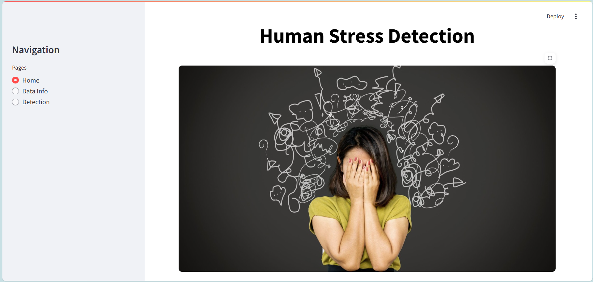
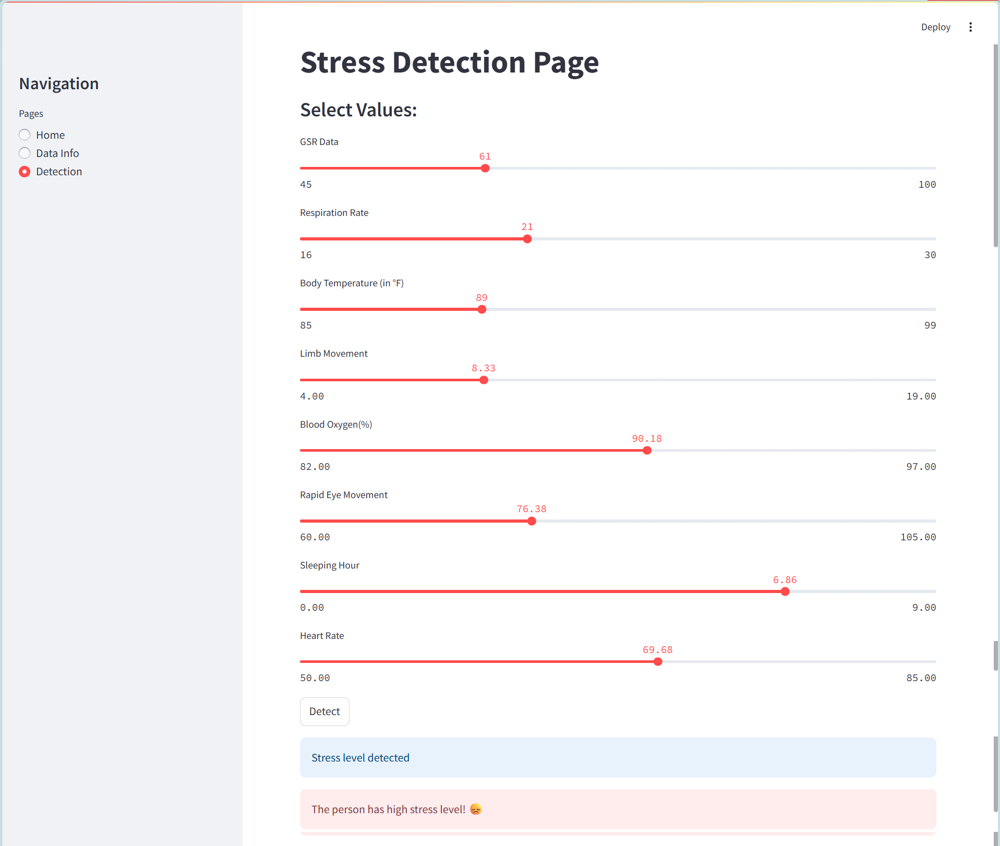

# 🧠 Human Stress Detection using Machine Learning

### 🔹 Home Interface


---

## 📌 Project Overview
This project aims to detect human stress levels based on sleeping habits using machine learning techniques.  

It analyzes physiological signals and predicts whether a person is experiencing:
- 🟢 Low Stress
- 🟡 Medium Stress
- 🔴 High Stress
  
---

## 🎯 Objectives
- Analyze relationship between sleep patterns and stress
- Build a predictive machine learning model
- Compare multiple ML algorithms
- Identify the best performing model

---

## 📊 Features Used
- Snoring Range  
- Respiration Rate  
- Body Temperature  
- Limb Movement  
- Blood Oxygen Level  
- Eye Movement  
- Heart Rate  

---

#### 📊 Data Info Page


---

## 🤖 Machine Learning Models
- Naïve Bayes ✅ (Best Model)
- Random Forest
- Decision Tree
- Support Vector Machine (SVM)
- Logistic Regression

---

## 📈 Results
- **Best Accuracy:** 91.27%
- **Best Model:** Naïve Bayes
- Evaluation Metrics:
  - Precision
  - Recall
  - F1-Score
  - RMSE
  - MAE

---

## 🖼️ Project Output

#### 📈 Output Prediction


---

## 📁 Project Structure

---

---

## ⚙️ Installation

### 1️⃣ Clone the Repository
```bash
git clone https://github.com/sabnevaishnavi007/Human_Stress_Detection_Using_ML.git
cd Human Stress Detection

### 2️⃣ Install Dependencies
```bash
pip install -r requirements.txt

### 3️⃣ Run the Project
```bash
streamlit run main.py
